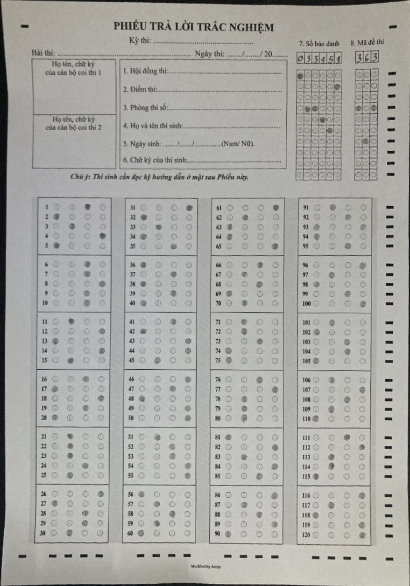
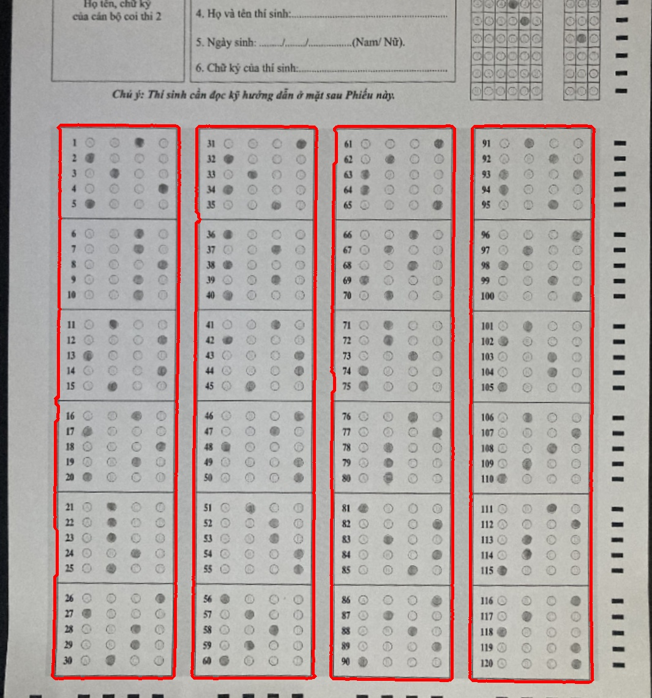
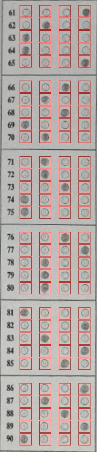
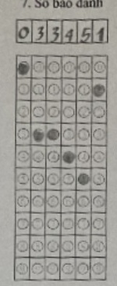

# Answer-Sheet-Extraction
Vietnamese High School Graduation Examination Answer Extraction using openCV-python

# Table of Contents
1. [Answer sheet template](#Answer-sheet-template)
2. [Installation and run](#Installation-and-run)
3. [APIs](#APIs)
4. [Docker](#Containerization)
4. [Algorithms](#Algorithms)
5. [References](#References)

# Answer sheet template 


# Installation and run
1. Clone repository
2. Run ```pip install -r requirements.txt```
3. Change the image path in ```tools/pipeline.py```
4. Run ```python tools/pipeline.py```


# Notes
- Highly recommend using [conda/miniconda](https://docs.anaconda.com/free/miniconda/miniconda-install/) for avoiding evironments conflicts.
- Test specific features? use the code in [```tools/```](./tools/)

# APIs
1. Running using ```uvicorn app:app --port 1234```
2. Test API via Swagger UI: [localhost:1234/docs](localhost:1234/docs)


# Containerization
1. Download and install [Docker](https://docs.docker.com/engine/install/)
2. Have a look at [Dockerfile](Dockerfile)
3. Build image ```docker build -t VNASE .```
4. Run container ```docker run -d --name vnase -p 80:80 VNASE```
5. Test API via Swagger UI: [localhost/docs](localhost/docs)

# Algorithms


**Input:** Answer sheet captured image
**Output:** List of answers, student ID and exam code
**Sample input:** 

.jpg)
**Solution:**
- **Phase 1:** Image preprocessing
    - Remove background (using [*GrabCut*](https://docs.opencv.org/3.4/d8/d83/tutorial_py_grabcut.html))

     
    

    - [Perspective transform](https://docs.opencv.org/3.4/da/d6e/tutorial_py_geometric_transformations.html)

     

- **Phase 2:** Extraction
    - Answer extraction:
        - Preprocess: crop - convert to grayscale - [remove noise](https://www.analyticsvidhya.com/blog/2022/08/image-contrast-enhancement-using-clahe/)

         

        - Detect answer boxes

         

        - Extract answer by create a grid on template (have a look at [grid.py](src/extraction/grid.py)) 

         

        - Threshold each answer bubles to decide if an answer was selected or not. (by counting non-zero pixel)

            - Not selected:  
            - Selected:  
        
    - Student ID and exam Code:
         
        - Preprocess: crop - convert to grayscale

        

        - Threshold - [erore and dilate](https://docs.opencv.org/3.4/db/df6/tutorial_erosion_dilatation.html)

        

        - Detect selected bubbles - calculate output based on bubbles position


# References
1. https://learnopencv.com/automatic-document-scanner-using-opencv/
2. https://docs.opencv.org/3.4/da/d22/tutorial_py_canny.html
3. https://docs.opencv.org/3.4/d4/d73/tutorial_py_contours_begin.html
4. https://www.analyticsvidhya.com/blog/2022/08/image-contrast-enhancement-using-clahe/
5. https://docs.opencv.org/3.4/db/df6/tutorial_erosion_dilatation.html
6. https://www.mathworks.com/help/visionhdl/ug/contrast-adaptive-histogram-equalization.html
7. https://docs.opencv.org/3.4/d8/d83/tutorial_py_grabcut.html
8. https://docs.opencv.org/3.4/da/d6e/tutorial_py_geometric_transformations.html